# Enterprise & Service Provider Network Engineering Lab

A hands-on network engineering lab built in GNS3 using Cisco IOSv appliances (IOS 15.9). I designed, configured, and verified this lab during a networking school project to experiment with real-world service provider backbones, multi-homed BGP traffic engineering, multi-tenant segmentation, and encrypted customer overlays.

The repository documents two complete, standalone topologies:

1. [Topology 1: Enterprise Multi-Homed Network & VRF-Lite](#topology-1-enterprise-multi-homed-network--vrf-lite)
2. [Topology 2: MPLS L3VPN Backbone & IPsec Overlays](#topology-2-mpls-l3vpn-backbone--ipsec-overlays)
3. [Lab Environment & Repository Structure](#lab-environment--repository-structure)

---

# Topology 1: Enterprise Multi-Homed Network & VRF-Lite

This topology models a resilient enterprise campus network with dual upstream Internet service providers, a hierarchical IS-IS IGP backbone, dynamic BGP traffic engineering, and VRF-Lite network virtualization for tenant isolation.

### Architecture Diagram

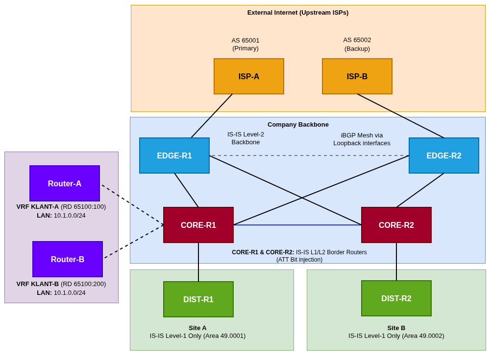

### Design Highlights

- **Hierarchical IS-IS Backbone:** The internal routing domain (`NetworkByte`) uses a two-tier IS-IS design. Distribution routers (`DIST-R1`, `DIST-R2`) operate strictly as **Level-1**, while edge routers (`EDGE-R1`, `EDGE-R2`) operate as **Level-2**. Core routers act as L1/L2 borders, originating default routes and summarizing internal subnets (`10.10.0.0/16`) into Level-2. All links utilize `metric-style wide`.
- **BGP Traffic Engineering:**
  - **Primary Path (ISP-A):** Outbound traffic defaults via ISP-A (`AS 65001`) by tagging incoming routes with `Local-Preference 200` on `EDGE-R1`.
  - **Backup Path (ISP-B):** Inbound traffic is steered away from ISP-B (`AS 65002`) by prepending the enterprise AS three times (`65100 65100 65100`), while outbound traffic receives `Local-Preference 100`.
  - **Policy-Based Exception:** Specific destination traffic for `9.0.0.0/8` is steered out through ISP-B by raising its `Local-Preference` to `300`.
  - **Internal Peering:** Full iBGP mesh between edge and core routers using Loopback interfaces and `next-hop-self`.
- **VRF-Lite Multi-Tenancy:** `CORE-R1` maintains three separate VRF instances (`KLANT-A`, `KLANT-B`, `KLANT-C`). Customer routers connect over dedicated subnets, allowing each tenant to safely reuse the identical internal `10.1.0.0/24` subnet without route collisions.

### Verification & Test Results

#### 1. BGP Peering Sessions (eBGP & iBGP)

BGP peering established across internal loopbacks and upstream WAN links:<br>
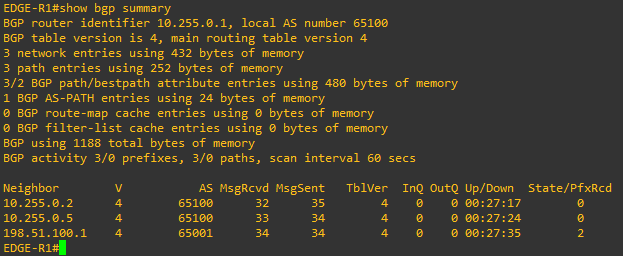

#### 2. IS-IS Neighbor Hierarchy & Routing

Adjacency verification showing distinct Level-1, Level-2, and Level-1-2 relationships:<br>
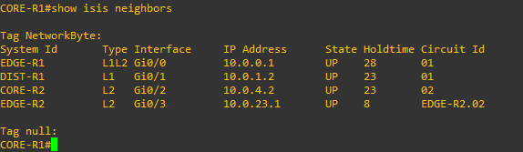

Routing table on `EDGE-R1` displaying inter-area reachability and summarized blocks:<br>
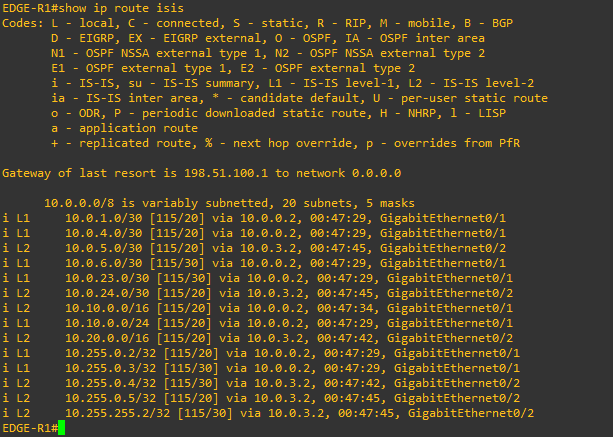

#### 3. Outbound Traffic Engineering (Local Preference)

- **Primary Path:** Traceroute to `8.8.8.1` confirms exit via `EDGE-R1` -> `ISP-A`:<br>
  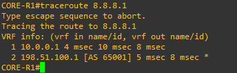

- **Engineered Policy Path:** Traceroute to `9.9.9.1` verifies that the `Local-Preference 300` policy takes effect, redirecting traffic across `CORE-R2` / `EDGE-R2` -> `ISP-B`:<br>
  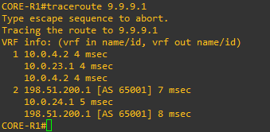

#### 4. VRF Route Isolation

Validation of separate customer routing tables on `CORE-R1`:<br>
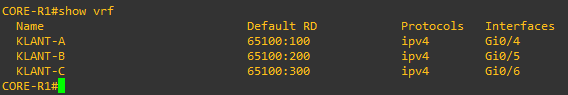

#### Device Configurations (Topology 1)

- **Edge Routers:** [`EDGE-R1.cfg`](./enterprise-dual-isp/configs/EDGE-R1.cfg), [`EDGE-R2.cfg`](./enterprise-dual-isp/configs/EDGE-R2.cfg)
- **Core Routers:** [`CORE-R1.cfg`](./enterprise-dual-isp/configs/CORE-R1.cfg), [`CORE-R2.cfg`](./enterprise-dual-isp/configs/CORE-R2.cfg)
- **Distribution Routers:** [`DIST-R1.cfg`](./enterprise-dual-isp/configs/DIST-R1.cfg), [`DIST-R2.cfg`](./enterprise-dual-isp/configs/DIST-R2.cfg)
- **ISP Nodes:** [`ISP-A.cfg`](./enterprise-dual-isp/configs/ISP-A.cfg), [`ISP-B.cfg`](./enterprise-dual-isp/configs/ISP-B.cfg)
- **Customer Premises:** [`Router-A.cfg`](./enterprise-dual-isp/configs/Router-A.cfg), [`Router-B.cfg`](./enterprise-dual-isp/configs/Router-B.cfg), [`Router-C.cfg`](./enterprise-dual-isp/configs/Router-C.cfg)

---

# Topology 2: MPLS L3VPN Backbone & IPsec Overlays

This topology simulates a Managed Service Provider backbone delivering multi-tenant L3VPN connectivity over an MPLS core, augmented with customer-managed route-based IPsec tunnels (IKEv2) for end-to-end zero-trust encryption across the provider cloud.

### Architecture Diagram

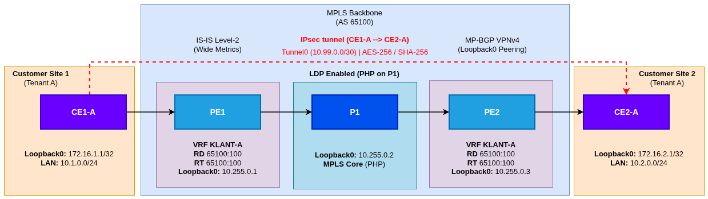

### Design Highlights

- **Provider Core Underlay (IS-IS & LDP):** The backbone (`PE-1`, `P-1`, `P-2`, `PE-2`) runs IS-IS as a single Level-2 domain with wide metrics. LDP distributes labels across all core links (`mpls ip`), with Penultimate Hop Popping (PHP) offloading the egress PE routers.
- **MP-BGP VPNv4 Control Plane:** PE routers peer via iBGP over their Loopbacks under AS `65100`. They activate the `vpnv4` address-family with extended communities to carry Route Targets.
  - `KLANT-A`: Route Distinguisher `65100:100`, Import/Export Route Target `65100:100`
  - `KLANT-B`: Route Distinguisher `65100:200`, Import/Export Route Target `65100:200`
  - Customer routes are redistributed per-VRF into MP-BGP on the PE routers.
- **Zero-Trust Customer IPsec Overlay:** Even though MPLS provides logical separation, provider core nodes handle customer packets in the clear. To guarantee confidentiality, Tenant A runs a route-based IPsec tunnel between `CE1-A` and `CE2-A` across the MPLS backbone:
  - **IKEv2 Phase 1:** AES-CBC-256 encryption, SHA-256 integrity, Diffie-Hellman Group 14, pre-shared authentication.
  - **IPsec Phase 2:** `esp-aes 256 esp-sha256-hmac` transform-set bound to virtual tunnel interfaces (`Tunnel0`).
  - **Encrypted Payload:** Customer traffic between `10.1.0.0/24` and `10.2.0.0/24` flows through `Tunnel0` (`10.99.0.0/30`), completely shielded from the provider.

### Verification & Test Results

#### 1. MPLS Label Forwarding Information Base (LFIB)

Checking `show mpls forwarding-table` on `PE-1` verifies incoming/outgoing label assignments and Penultimate Hop Popping (`Pop Label`) behavior toward P-routers:<br>
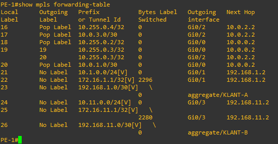

#### 2. MP-BGP VPNv4 Routes

Checking `show bgp vpnv4 unicast all` confirms that routes from both customer VRFs are tagged with their respective Route Distinguishers and propagated across the PE mesh:<br>
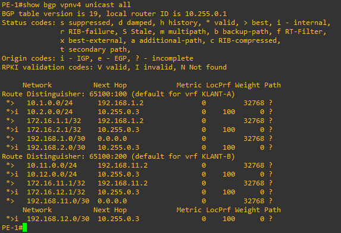

#### 3. IKEv2 Phase 1 SA Status

Checking `show crypto ikev2 sa` on `CE1-A` confirms successful Phase 1 security association with `CE2-A` in the `READY` state:<br>
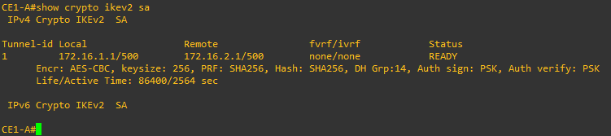

#### 4. IPsec Phase 2 SA & Packet Counters

Checking `show crypto ipsec sa` verifies live encryption and decryption, with incrementing `pkts encaps` and `pkts decaps` counters on `Tunnel0`:<br>
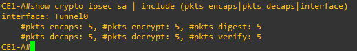

#### 5. Data Plane Reachability & Multi-Tenant Isolation

End-to-end ping tests from `CE1-A` confirm connectivity across the encrypted tunnel (`10.99.0.2`), while packets targeting Tenant B (`10.99.1.2`) are dropped:<br>
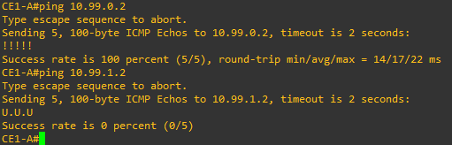

#### Device Configurations (Topology 2)

- **Provider Edge:** [`PE-1.cfg`](./mpls-service-provider/configs/PE-1.cfg), [`PE-2.cfg`](./mpls-service-provider/configs/PE-2.cfg)
- **Provider Core:** [`P-1.cfg`](./mpls-service-provider/configs/P-1.cfg), [`P-2.cfg`](./mpls-service-provider/configs/P-2.cfg)
- **Customer Edge (Tenant A):** [`CE1-A.cfg`](./mpls-service-provider/configs/CE1-A.cfg), [`CE2-A.cfg`](./mpls-service-provider/configs/CE2-A.cfg)
- **Customer Edge (Tenant B):** [`CE1-B.cfg`](./mpls-service-provider/configs/CE1-B.cfg), [`CE2-B.cfg`](./mpls-service-provider/configs/CE2-B.cfg)

---

# Lab Environment & Repository Structure

- **Emulation Platform:** GNS3
- **Appliances:** Cisco IOSv (`vios-adventerprisek9-m`, Cisco IOS Software Version 15.9(3)M)
- **Configurations:** All device configurations are backed up as clean, readable `.cfg` files in their respective `configs/` folders.

```text
isp-and-enterprise-network/
├── enterprise-dual-isp/
│   ├── configs/            # Running configs for Edge, Core, Dist, ISP & Customer routers
│   └── screenshots/        # CLI verification (BGP, IS-IS, traceroute, VRF)
├── mpls-service-provider/
│   ├── configs/            # Running configs for PE, P, and CE routers
│   └── screenshots/        # CLI verification (MPLS LFIB, MP-BGP, IKEv2, IPsec, ping)
├── LICENSE
└── README.md
```
