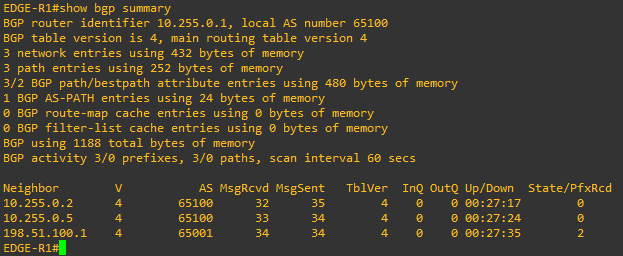
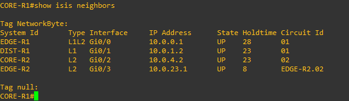
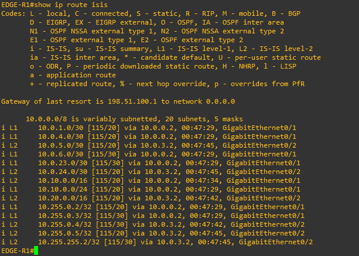
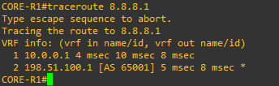
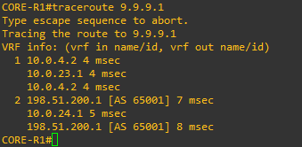
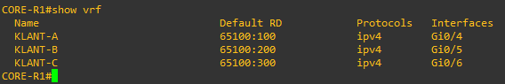

# Topology 1: Enterprise Multi-Homed Network & VRF-Lite

## Architecture Summary

An enterprise network featuring a multi-level IS-IS underlay, dual upstream ISP uplinks with automated BGP traffic engineering, and multi-tenant VRF-Lite isolation.

---

## Key Protocols & Features

- **IS-IS Backbone:** Level-1 and Level-2 hierarchy segregating core and distribution areas using wide metrics.
- **BGP Multi-Homing & TE:**
  - Primary Internet path routed via ISP-A (`AS 65001`) with `Local-Preference 200`.
  - Backup Internet path configured via ISP-B (`AS 65002`) with `Local-Preference 100` and inbound AS-Path prepending (`65100 65100 65100`).
  - Custom policy-routing sending specific prefix `9.0.0.0/8` across ISP-B with `Local-Preference 300`.
- **VRF-Lite Multi-Tenancy:** Separation of customer routing contexts on `CORE-R1` supporting overlapping private subnets across `KLANT-A`, `KLANT-B`, and `KLANT-C`.

---

## Verification & Proof

### 1. BGP Peering Sessions (eBGP & iBGP)

BGP peering established across internal loopbacks and upstream WAN links. 

### 2. IS-IS Neighbor Hierarchy & Summarization

IS-IS neighbor adjacencies showing distinct Level-1, Level-2, and Level-1-2 relationships. 

IS-IS routing table on `EDGE-R1` demonstrating inter-area reachability and summarized blocks. 

### 3. Outbound Traffic Engineering (Local Preference)

- Traceroute to `8.8.8.1` routed out primary path (`EDGE-R1` → `ISP-A`): 
  

- Traceroute to `9.9.9.1` manipulated to egress via backup link (`CORE-R2` / `EDGE-R2` → `ISP-B`): 
  

### 4. VRF Routing Isolation

Validation of isolated customer routing instances on `CORE-R1`: 

---

## Device Configurations

All device configurations are stored in the [`configs/`](./configs/) directory:

- **Edge Routers:** [`EDGE-R1.cfg`](./configs/EDGE-R1.cfg), [`EDGE-R2.cfg`](./configs/EDGE-R2.cfg)
- **Core Routers:** [`CORE-R1.cfg`](./configs/CORE-R1.cfg), [`CORE-R2.cfg`](./configs/CORE-R2.cfg)
- **Distribution Routers:** [`DIST-R1.cfg`](./configs/DIST-R1.cfg), [`DIST-R2.cfg`](./configs/DIST-R2.cfg)
- **ISP Nodes:** [`ISP-A.cfg`](./configs/ISP-A.cfg), [`ISP-B.cfg`](./configs/ISP-B.cfg)
- **Customer Routers:** [`Router-A.cfg`](./configs/Router-A.cfg), [`Router-B.cfg`](./configs/Router-B.cfg), [`Router-C.cfg`](./configs/Router-C.cfg)
