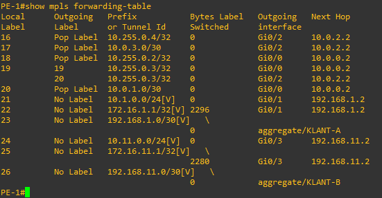
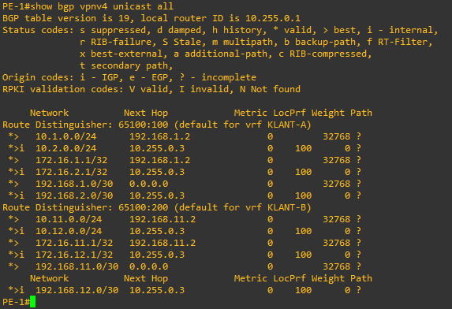
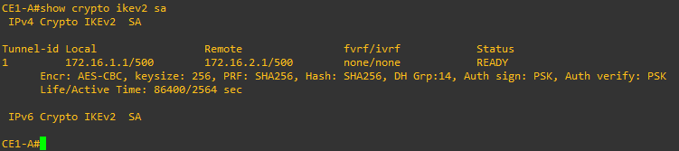
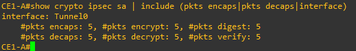
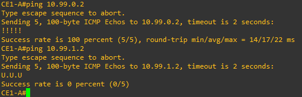

# Topology 2: MPLS L3VPN Backbone & IPsec Overlays

## Architecture Summary

A complete Managed Service Provider (MSP) MPLS core supporting multi-tenant L3VPNs and end-to-end customer cryptographic tunneling using IKEv2 and IPsec.

---

## Key Protocols & Features

- **MPLS / LDP Core:** Penultimate Hop Popping (PHP), label assignment via LDP, and dual redundant P-routers (`P-1`, `P-2`).
- **MP-BGP VPNv4 Control Plane:** Route Distinguishers (RD) and Route Targets (RT) ensuring complete isolation between customer VPNs:
  - `KLANT-A`: RD `65100:100`
  - `KLANT-B`: RD `65100:200`
- **IPsec Over L3VPN:** End-to-end customer encryption across the provider core using route-based IKEv2 tunnels with AES-CBC-256 and SHA-256.

---

## Verification & Proof

### 1. MPLS Label Forwarding (LFIB)

LFIB entries on `PE-1` demonstrating label push, swap, and PHP pop actions alongside VRF-specific allocations: 

### 2. MP-BGP VPNv4 Multi-Tenancy

Validation of route propagation across both customer instances (`KLANT-A` and `KLANT-B`): 

### 3. IKEv2 Phase 1 Status

IKEv2 Security Association status confirming `READY` state and cipher negotiation: 

### 4. IPsec Packet Encapsulation

IPsec Phase 2 SA metrics verifying incrementing packet encapsulation and encryption counters across `Tunnel0`: 

### 5. Reachability & Tenant Isolation

Proof of end-to-end communication across the encrypted tunnel (`10.99.0.2`) alongside drop behavior toward tenant B (`10.99.1.2`): 

---

## Device Configurations

All device configurations are stored in the [`configs/`](./configs/) directory:

- **Provider Edge:** [`PE-1.cfg`](./configs/PE-1.cfg), [`PE-2.cfg`](./configs/PE-2.cfg)
- **Provider Core:** [`P-1.cfg`](./configs/P-1.cfg), [`P-2.cfg`](./configs/P-2.cfg)
- **Customer Edge (Tenant A):** [`CE1-A.cfg`](./configs/CE1-A.cfg), [`CE2-A.cfg`](./configs/CE2-A.cfg)
- **Customer Edge (Tenant B):** [`CE1-B.cfg`](./configs/CE1-B.cfg), [`CE2-B.cfg`](./configs/CE2-B.cfg)
